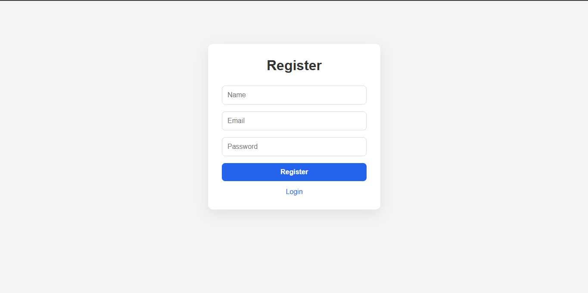
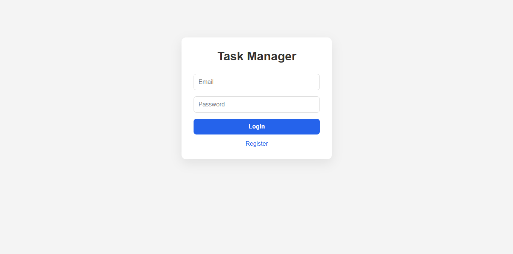
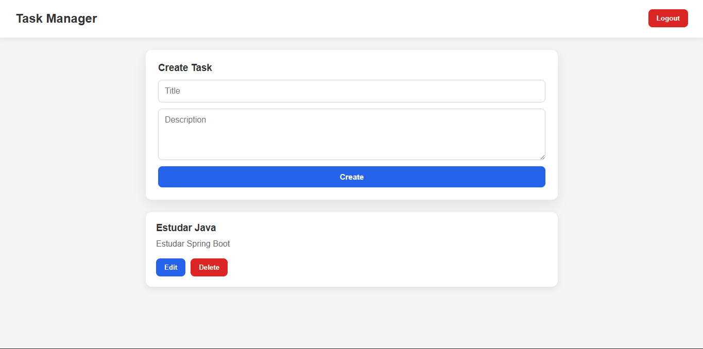

# JWT Auth CRUD

Aplicação full stack de gerenciamento de tarefas desenvolvida com foco em demonstrar conhecimentos em desenvolvimento backend com Spring Boot, autenticação JWT, PostgreSQL e Docker.

O frontend foi desenvolvido em Angular para fornecer uma interface simples para consumir a API.

# Funcionalidades

### Autenticação 

- Cadastro de usuários
- Login de usuários
- Autenticação com JWT
- Sessões stateless
- Proteção de rotas

### Validações

- Bean Validation
- Tratamento global de exceções
- Validação no frontend

# Tecnologias Utilizadas

### Backend

- Java 21
- Spring Boot 4
- Spring Security
- JWT
- Spring Data JPA
- PostgreSQL
- Maven
- Docker

### Frontend

- Angular 21
- TypeScript
- RxJS
- Angular Router

# Arquitetura

O backend foi organizado nas seguintes camadas:

- Controller
- Service
- Repository
- DTO
- Security
- Exception Handler

Princípios aplicados:

- SOLID
- Injeção de Dependências
- Autenticação Stateless

#  Executando o projeto

### Pré-requisitos

- Docker

### Iniciando a aplicação

```bash
docker compose up --build
```

Frontend

```text
http://localhost:4200
```

Backend

```text
http://localhost:8080
```

PostgreSQL

```text
localhost:5432
```

### Parando a aplicação

```bash
docker compose down
```
# Endpoints da API

### Autenticação

| Método | Endpoint | Descrição |
|--------|----------|-----------|
| POST | `/auth/register` | Registrar usuário |
| POST | `/auth/login` | Realizar login |

### Tarefas

| Método | Endpoint |
|--------|----------|
| GET | `/tasks` |
| GET | `/tasks/{id}` |
| POST | `/tasks` |
| PUT | `/tasks/{id}` |
| DELETE | `/tasks/{id}` |

# Estrutura do projeto

### Backend

```text
src/main/java/com/caio/api/authcrud

├── controller
├── dto
├── exception
├── repository
├── security
├── service
└── model
```

### Frontend

```text
src/app

├── components
├── interceptors
├── models
├── services
└── guards
```

# Capturas de tela

### Registro



### Login



### Tasks




# Melhorias futuras

- Implementação de Refresh Tokens
- Testes unitários
- Testes de integração
- Documentação com Swagger/OpenAPI
- Pipeline de CI/CD
- Deploy em provedor de nuvem

# Autor

Caio Pedro Viana da Silva

GitHub: https://github.com/cavinski